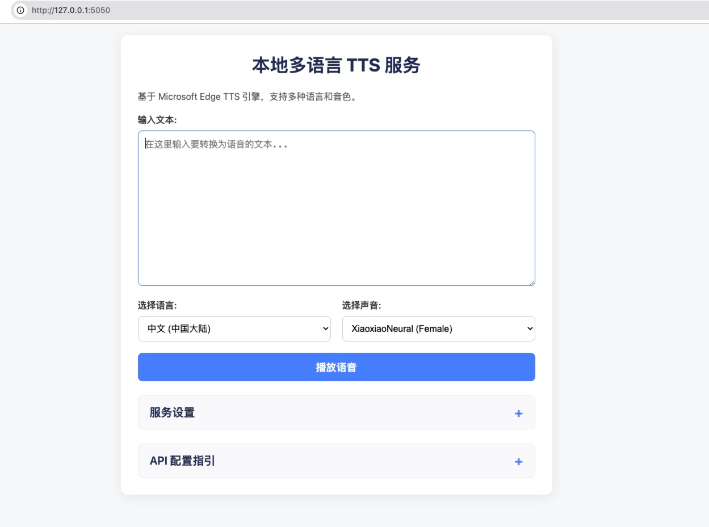
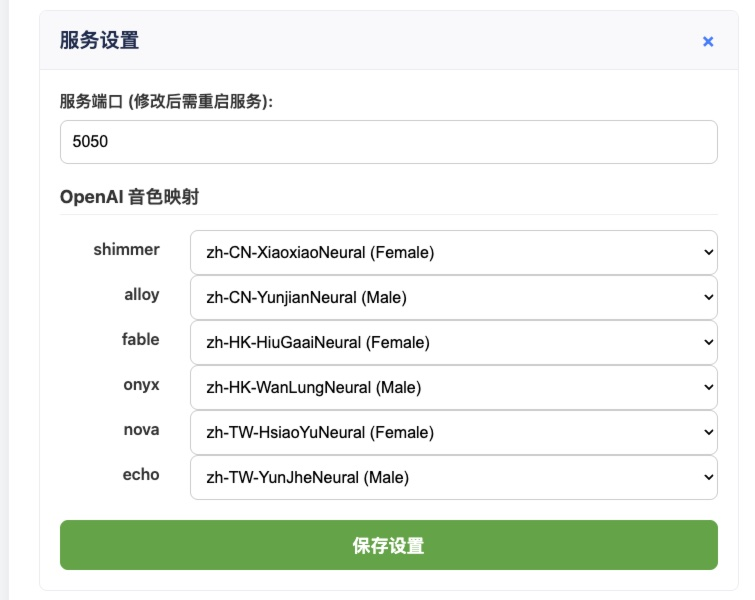
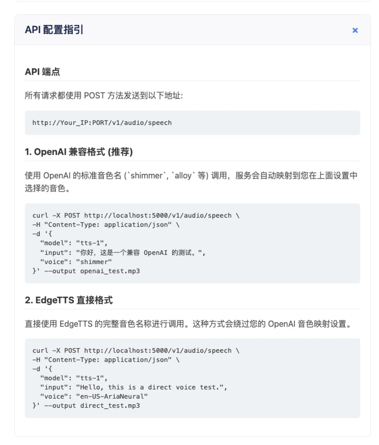

# 🚀 LocalTTS - 高性能、高可靠的本地化 TTS 语音服务

一个基于 Microsoft Edge TTS 引擎的本地语音合成服务，经过深度优化，能以极高的效率和可靠性处理长文本。它提供了一个简洁的 Web 界面和一套兼容 OpenAI TTS API 格式的接口，让您可以轻松地将高质量、高效率的文本转语音功能集成到任何应用中。



---

## ✨ 功能亮点

- **极致性能与可靠性**:

  - **高级文本处理**: 采用先进算法对输入文本进行**净化和重组**，能智能处理不合理的换行符和空格，并正确识别小数点，从源头上保证语音的自然流畅。
  - **智能分块**: 在文本预处理的基础上，将长文本智能地合并成大小适中、语义连贯的块，**极大减少了拼接点**，显著提升了听感。
  - **并发控制与可靠重试**: 使用异步信号量精确控制并发请求数量（默认为 20），既能享受并发带来的高效率，又避免了因请求过多而导致的“并发风暴”和服务器限流。
  - **闪电般拼接**: 使用系统级的 **FFmpeg** 进行音频流的无损拼接，速度是纯 Python 实现的数十倍，彻底解决超长文本合成时的本地处理瓶颈。
  - **快速输出**: 实测处理 **3 万字** 的长文（生成约 1.5 小时音频），**总耗时仅需 1-2 分钟**，性能卓越。

- **安全与易用**:

  - **API 密钥保护**: 支持通过 WebUI 设置 API 密钥，保护您的服务不被滥用。
  - **WebUI 登录保护**: 支持设置独立的 WebUI 访问密码，保障您的配置安全。
  - **智能 API 指引**: API 使用说明中的 `curl` 示例会根据您的设置，**自动**包含或移除密钥认证头，方便复制和测试。
  - **一键 Docker 部署**: 提供 `docker-compose` 配置，一条命令即可启动包含所有依赖（包括 FFmpeg）的完整服务。

- **高度可配置**:
  - **动态端口与密钥设置**: 通过 WebUI 轻松设置服务运行的端口和 API 密钥。
  - **自定义音色映射**: 通过 WebUI 为 OpenAI 的标准音色 (`shimmer`, `alloy` 等) 灵活指定您喜欢的任何 `edge-tts` 语音。
    

## 🐳 使用 Docker 部署 (推荐)

这是最简单、最可靠的部署方式。**Docker 方案已内置 FFmpeg，您无需任何额外安装。**

### 环境要求

- **Docker**: [安装 Docker Desktop](https://www.docker.com/products/docker-desktop/) (适用于 Windows, macOS, 和 Linux)

### 部署步骤

1.  **下载项目**
    克隆或下载本项目所有文件到您的本地。

2.  **创建并配置 `.env` 文件**

    - 项目中包含一个 `.env.example` 文件作为模板。请先将其复制为 `.env` 文件：

      ```bash
      # 在 Linux / macOS 上
      cp .env.example .env

      # 在 Windows PowerShell 上
      copy .env.example .env
      ```

    - **设置 WebUI 登录密码 (强烈推荐)**: 编辑 `.env` 文件，为 `WEBUI_PASSWORD` 设置一个复杂的密码。
    - **端口配置 (可选)**: 修改 `TTS_PORT` 的值来指定端口（默认为 `5050`）。
    - **国内用户网络优化 (重要)**: 如果您在中国大陆地区的服务器上部署，请取消 `PIP_INDEX_URL` 这一行的注释。

3.  **启动服务**
    在项目根目录下，打开终端或 PowerShell 并运行：

    ```bash
    # 首次启动或代码更新后，使用此命令构建并启动
    docker-compose up --build -d

    # 日后如果只是想重新启动服务，使用此命令即可
    docker-compose up -d
    ```

4.  **访问 WebUI**
    - 打开浏览器，访问 `http://localhost:5050` (或您在 `.env` 中配置的端口)。
    - **重要**: 首次启动后，强烈建议您进入 **服务设置**，设置您的 **API 密钥**并保存。

### Docker 管理命令

- **启动服务**: `docker-compose up -d`
- **停止服务**: `docker-compose down`
- **查看运行状态**: `docker ps`
- **查看服务日志**: `docker-compose logs -f`

---

## 🛠️ 手动部署 (高级)

### 环境要求

- **Python**: 3.8 或更高版本
- **FFmpeg**: **必须在您的系统中安装 FFmpeg。**
- **Conda**: (推荐)

### 1. 安装 FFmpeg (关键步骤)

- #### **Windows (使用 Scoop 或 Chocolatey 包管理器)**
  - **Scoop (推荐)**: `scoop install ffmpeg`
  - **Chocolatey**: `choco install ffmpeg`
- #### **macOS (使用 Homebrew)**
  ```bash
  brew install ffmpeg
  ```
- #### **Linux (Debian/Ubuntu)**
  ```bash
  sudo apt update && sudo apt install ffmpeg
  ```
  安装后，运行 `ffmpeg -version` 验证。

### 2. 部署 Python 环境

1.  **创建并激活 Conda 环境**:
    ```bash
    conda create -n local-tts python=3.10 -y
    conda activate local-tts
    ```
2.  **安装 Python 依赖**:
    ```bash
    pip install -r requirements.txt
    ```
3.  **启动服务**:
    ```bash
    python app.py
    ```

---

## 📖 API 使用说明

API 指引部分已集成在 WebUI 中，并能根据您的访问地址和密钥设置动态生成。


### 端点

- `POST /v1/audio/speech`

### 请求格式

- **Headers**:
  - `Content-Type: application/json`
  - `Authorization: Bearer <Your-API-Token>` (如果已在 WebUI 中设置)
- **Body**:
  ```json
  {
    "model": "tts-1",
    "input": "要转换的文本。",
    "voice": "shimmer"
  }
  ```
  - `voice`: 可以是 OpenAI 的标准音色 (`shimmer`, `alloy` 等)，也可以是任意 EdgeTTS 的完整音色名称 (如 `zh-CN-XiaoxiaoNeural`)。

---

## 🤝 贡献

欢迎任何形式的贡献！如果您有任何想法、建议或发现 Bug，请随时提交一个 Issue。

## 📄 许可

本项目采用 [MIT 许可证](LICENSE)。
