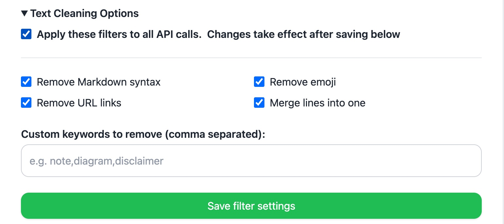
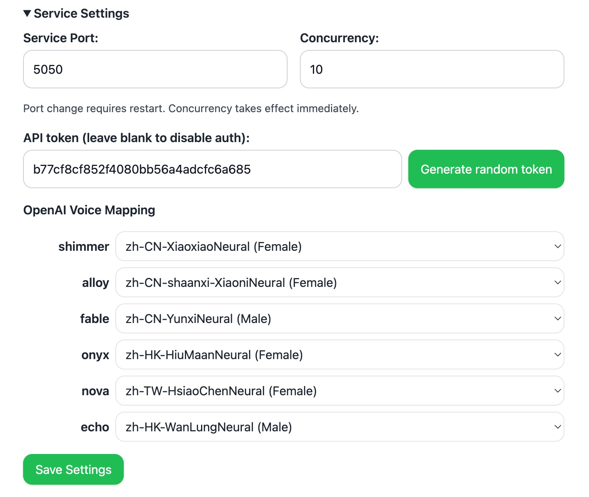
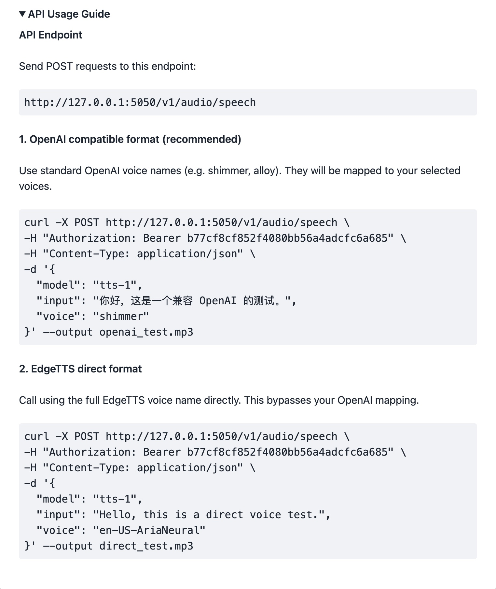

# 🚀 LocalTTS - Your private, high-performance text-to-speech service

[](https://github.com/samni728/Local-TTS-Service)

**LocalTTS** is a local TTS solution powered by the Microsoft Edge TTS engine. It is more than a tool — it is a complete, self-hostable speech center. We have optimized it heavily so that it can handle extremely long text with incredible efficiency and reliability. Whether you want to listen to a lengthy article or give your AI application a vibrant voice, LocalTTS makes it easy.


---

_For the Chinese version of this document, please see [README.zh.md](README.zh.md)._

## 🌟 Why choose LocalTTS?

We poured a great deal of effort into making LocalTTS powerful yet simple to use. It is not only functional but also reliable and pleasant to work with.

### 1. Built for long-form listening: extreme performance

We know you might want to listen to an entire ebook or a multi-page PDF. To that end we engineered unmatched performance:

- **Advanced text processing**: automatically cleans and restructures any messy text you paste in, intelligently handling line breaks and spaces for a natural flow.
- **Concurrency and fault tolerance**: industrial-grade concurrency control and retry logic ensure speech generation even for very long texts or unstable networks.
- **Blazing speed**:
  - **Lossless FFmpeg merging**: audio is stitched together using system FFmpeg, dozens of times faster than Python-only solutions.
  - **Real-world performance**: from a 30,000-word report (about 20 pages of A4) it can generate a high-quality MP3 of around 1.5 hours in just 1–2 minutes.

### 2. Made for AI applications: seamless integration with the OpenAI ecosystem

If you build AI applications, LocalTTS is the perfect local TTS alternative:

- **OpenAI API compatible**: offers an API fully compatible with OpenAI TTS (`v1/audio/speech`).
- **Drop-in replacement**: connect any tool that supports the OpenAI TTS API—`Dify`, `LobeChat`, `LM Studio`, `Jan`, etc. Simply change the API endpoint and model name to enjoy free, unlimited, censorship-free local synthesis.
- **Custom voice mapping**: use the WebUI to map standard OpenAI voices like `alloy` or `shimmer` to your favorite EdgeTTS voices for a unique AI assistant sound.

### 3. Designed for everyone: highly configurable and easy to use

Powerful features shouldn't come at the cost of usability.

- **One-click Docker deployment**: the most beginner-friendly approach, hiding all environment complexity.
- **Intuitive WebUI**:
  - **Dynamic configuration center**: set ports, concurrency, and API keys directly in the browser.
  - **Robust text filters**: remove Markdown, URLs, and emojis with a click or define custom keyword filters for total control over what is read aloud.
    
    
- **Two layers of security**: optional WebUI login password and API key ensure your service stays secure.

## 📖 Use cases

LocalTTS has endless possibilities; here are just a few examples:

- **Personal audiobook companion**: convert ebooks (TXT, EPUB), long web articles, or work reports (PDF) into audio so you can listen while commuting or exercising.
- **Voice-enable your AI apps**: provide a stable, free, high-quality speech backend for `Dify`, `LobeChat`, or any LangChain/LLM project.
- **Content creation helper**: quickly turn drafts into audio so you can proofread by listening.
- **Learning and accessibility tool**: a powerful reader for users with visual impairments or reading difficulties.

## 🐳 Quick start: deploy with Docker (recommended)

This is the easiest and most reliable way. **The Docker image includes FFmpeg out of the box.**

### Steps

1.  **Download the project**: `git clone https://github.com/samni728/Local-TTS-Service.git`
2.  **Create and configure the `.env` file**:
    - `cp .env.example .env`
    - Edit `.env`. **It is strongly recommended to set `WEBUI_PASSWORD`.**
    - If you are in China, uncomment `PIP_INDEX_URL` and `USE_CHINA_MIRRORS`.
3.  **Start the service**:

```bash
# First time or after updates
docker-compose up --build -d

# Normal start
docker-compose up -d
```

4.  **Access & configure**: - Visit `http://localhost:5050` (or your chosen port) in your browser. - After logging in, open **Service Settings**, set your **API key**, and save.
    
For streaming performance tips, see [Streaming Optimization](docs/STREAMING_OPTIMIZATION.md).


## 🤝 Contributing

All kinds of contributions are welcome! If you have ideas, suggestions, or find bugs, please open an issue. If this project helps you, please give us a ⭐ on GitHub!

## 📄 License

This project is released under the [MIT License](LICENSE).
