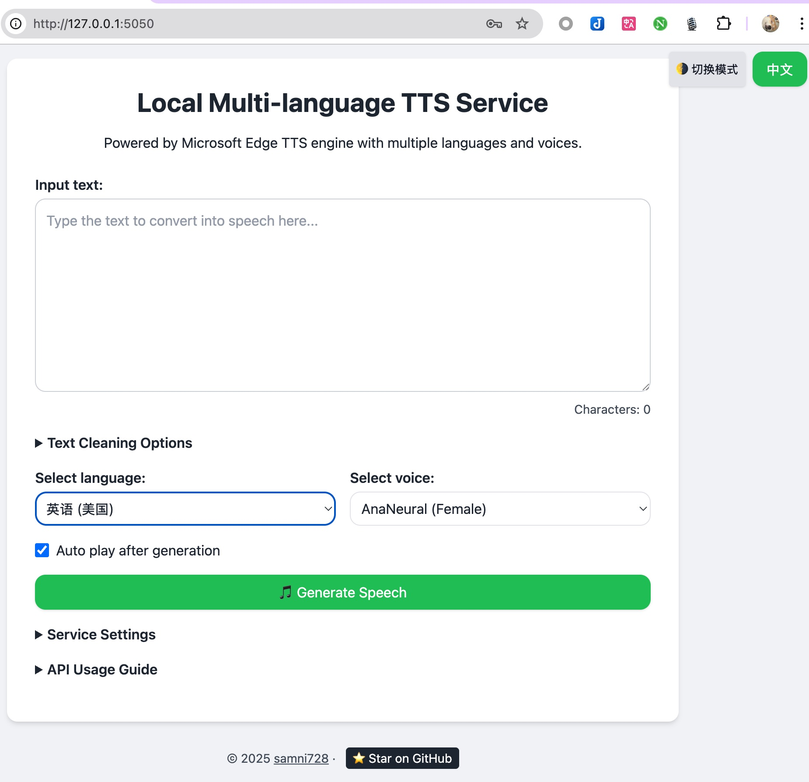

# 🚀 LocalTTS - 您私有的、高性能、高可用的语音合成服务

[](https://github.com/samni728/Local-TTS-Service)

_English version available in [README.md](README.md)._

**LocalTTS** 是一个基于 Microsoft Edge TTS 引擎的本地语音合成解决方案。它不仅仅是一个工具，更是一个**完整的、可私有化部署的语音中心**。我们对它进行了深度优化，能以惊人的效率和极高的可靠性处理超长文本，让您无论是想“听”一篇万字长文，还是为您的 AI 应用赋予动听的声音，都能轻松实现。



---

## 🌟 为什么选择 LocalTTS？

我们倾注了大量心血，将 LocalTTS 打造成了一个功能强大且极易使用的服务。它不仅仅是“能用”，更是“好用”和“可靠”。

### 1. 为“听书”和长文档而生：极致性能

我们知道，您可能想用它来听一整本电子书或一份几十页的 PDF 报告。为此，我们打造了无与伦比的性能：

- **高级文本处理**: 自动净化和重组您复制粘贴的任何“脏”文本，智能处理不合理的换行和空格，确保听感流畅自然。
- **并发与容错**: 采用工业级的并发控制和重试机制，即使面对超长文本和不稳定的网络，也能最大程度保证语音的完整生成。
- **闪电般的速度**:
  - **FFmpeg 无损拼接**: 我们用系统级的 FFmpeg 进行音频拼接，速度是普通 Python 方案的数十倍。
  - **实测性能**: 处理一份 **3 万字** 的报告（约等于 20 页 A4 纸内容），生成长达 **1.5 小时**的高质量 MP3 音频，**总耗时仅需 1-2 分钟**！

### 2. 为 AI 应用而造：无缝集成 OpenAI 生态

如果您是 AI 应用的开发者，LocalTTS 将是您完美的本地 TTS 替代方案：

- **兼容 OpenAI API**: 提供与 OpenAI TTS (`v1/audio/speech`) 完全兼容的 API 接口。
- **平替方案**: 您可以将 `Dify`, `LobeChat`, `LM Studio`, `Jan` 等任何支持 OpenAI TTS 接口的 AI 应用，无缝对接到 LocalTTS。只需修改 API 地址和模型名称，即可享受**免费、不限速、无内容审查**的本地语音合成服务。
- **自定义音色映射**: 您可以通过 WebUI，将 OpenAI 的 `alloy`, `shimmer` 等标准音色，**自由映射**到您最喜欢的任何 EdgeTTS 语音上，打造独一无二的 AI 助手声音。

### 3. 为所有人而设计：强大的可配置性与易用性

我们相信，强大的功能不应以牺牲易用性为代价。

- **一键 Docker 部署**: 对新手最友好的部署方式，屏蔽所有复杂环境配置。
- **直观的 WebUI**:
  - **动态配置中心**: 在网页上即可轻松设置端口、并发数、API 密钥。
  - **强大的文本过滤器**: 一键移除 Markdown、URL、表情符号，或通过简单的关键词列表进行自定义过滤，让您对朗读内容拥有完全的控制权。
    
    
- **双重安全保障**: 可选的 WebUI 登录密码和 API 密钥，确保您的服务在任何网络环境下都安全无虞。

## 📖 使用场景

LocalTTS 的可能性是无限的，这里仅列举几例：

- **个人听书神器**: 将您下载的电子书（TXT, EPUB）、网上长文或工作报告（PDF）转换为有声读物，在通勤、锻炼时解放双眼。
- **AI 应用语音赋能**: 为您的 `Dify` 应用、`LobeChat` 机器人或任何基于 LangChain/LLM 的项目，提供一个稳定、免费且高质量的语音输出后端。
- **内容创作辅助**: 快速将您的文章草稿转换为音频，通过“听”的方式来校对文稿的流畅度和节奏感。
- **学习与辅助工具**: 为视力障碍者或阅读困难者提供一个强大的文本朗读工具。

## 🐳 快速开始：使用 Docker 部署 (推荐)

这是最简单、最可靠的部署方式。**Docker 方案已内置 FFmpeg，您无需任何额外安装。**

### 部署步骤

1.  **下载项目**: `git clone https://github.com/samni728/Local-TTS-Service.git`
2.  **创建并配置 `.env` 文件**:
    - `cp .env.example .env`
    - 编辑 `.env` 文件，**强烈建议设置 `WEBUI_PASSWORD`**。
    - 如果您在国内服务器，请取消 `PIP_INDEX_URL` 和 `USE_CHINA_MIRRORS` 的注释。
3.  **启动服务**:

    ```bash
    # 首次启动或更新后
    docker-compose up --build -d

    # 日常启动
    docker-compose up -d
    ```

4.  **访问与配置**:
    - 打开浏览器访问 `http://localhost:5050` (或您设置的端口)。
    - 登录后，进入**服务设置**，设置您的**API 密钥**并保存。


## 🤝 贡献

欢迎任何形式的贡献！如果您有任何想法、建议或发现 Bug，请随时提交一个 Issue。如果这个项目对您有帮助，请在 GitHub 上给我们一颗 ⭐ Star！

## 📄 许可

本项目采用 [MIT 许可证](LICENSE)。
